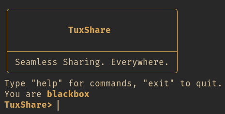

# 🐧 TuxShare




TuxShare is a lightweight peer discovery and file-sharing tool written in Dart.
It’s meant to work simply on local networks, finding other devices and moving
files around without hassle. Think of it as your LAN’s little penguin courier —
fast, simple, and always ready 🐧✨.

## ✨ features

- **Automatically discovers peers** using multicast magic
- **Provides an interactive shell** with handy commands
- **Sends & receives files** over the local network
- **Requires no extra dependencies** beyond Dart (for building) and a working
  network stack
- **Offers a clean terminal UI** with cool ANSI visuals

## 📦 installation

### 📥 binaries

Binaries are available under the
[releases](https://github.com/TechTowers/tuxshare/releases) tab for Windows and
Linux[^1] respectively.

[^1]:
    NixOS Users should probably just use the nix package as these binaries
    only work for ~inferior~ normal distributions

### 🧰 self compiled

You can install TuxShare on Linux and Windows by having
[dart](https://dart.dev/get-dart) and [git](https://git-scm.com/downloads)
installed and running:

```bash
git clone https://github.com/TechTowers/tuxshare.git
cd tuxshare
dart pub get
dart compile exe bin/tuxshare.dart
```

## ️🖥️ usage

> [!IMPORTANT]
> Make sure to open these ports (and ofc don't have anything running on them):
>
> - 6969 (UDP)
> - 9696 (TCP)

Just run `tuxshare`, and you'll be ready to go.

- Use `help` to see all available commands 🙂

### ❄️ nix (with flakes)

Add this thingy to your inputs:

```nix
inputs = {
  # ...
  tuxshare = {
    url = "github:TechTowers/tuxshare";
    inputs = {
      nixpkgs.follows = "nixpkgs";
    };
  };
  # ...
};
```

Andddd add this the package to home-manager or your system wide nix config:

```nix
inputs.tuxshare.packages.${pkgs.system}.default
```

## 🤝 Contributing

Feel free to open issues or pull requests! We’d love to improve TuxShare
together.

## 📄 License

TuxShare is released under the GPLv3 License.
